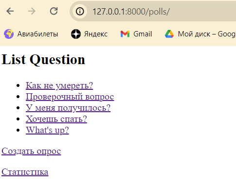
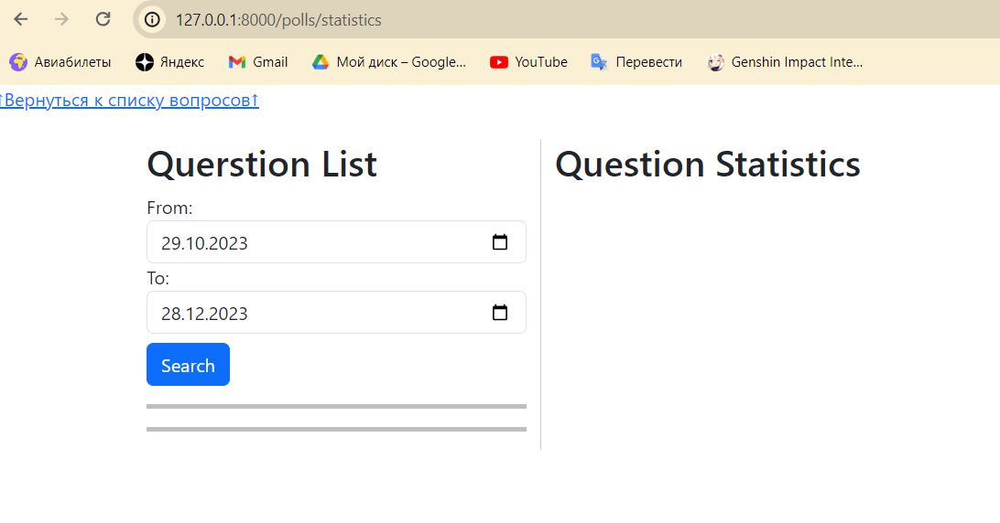
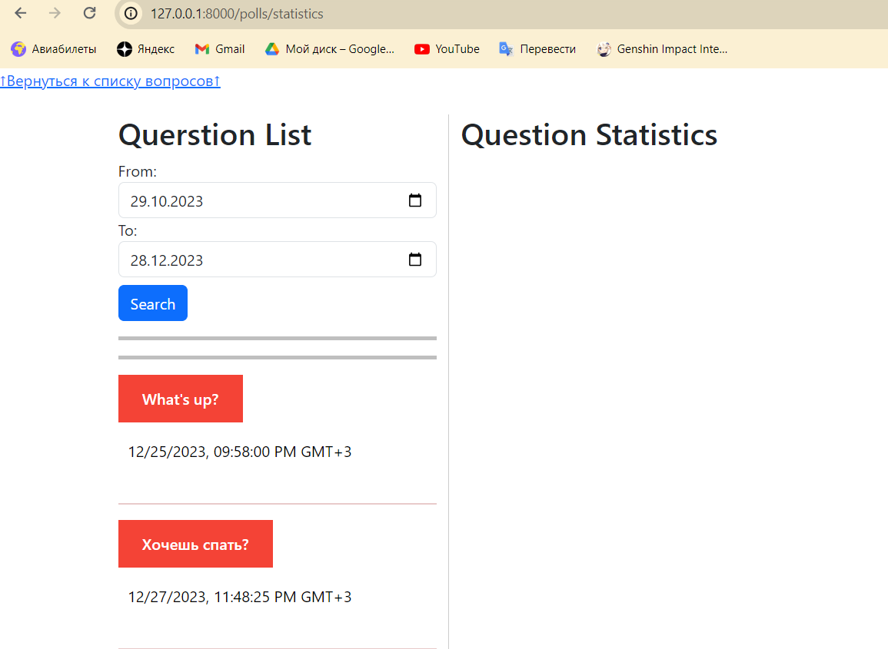
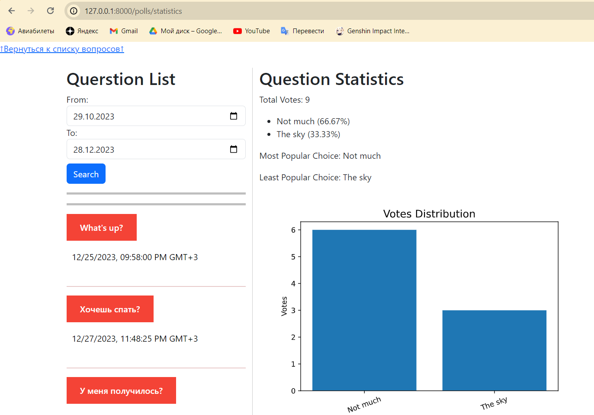

# Отчет по ЛР 7
1. Новая ссылка в polls на статистику  
  
3. Микросервис, отвечаюший задачам:
•Статистика по голосованиям: микросервис может агрегировать данные о голосах, проведенных в приложении для создания голосований. Это включает в себя общее количество голосований, количество голосов на каждый вариант ответа, а также процентное соотношение голосов.  
• Сортировка и фильтрация данных: пользователи могут сортировать голосования по различным параметрам, таким как дата проведения, популярность, или количество голосов.  
• Графики и диаграммы: микросервис может предоставлять графики и диаграммы, которые визуализируют результаты голосования, что делает аналитику более понятной и наглядной.  
  
  
  
